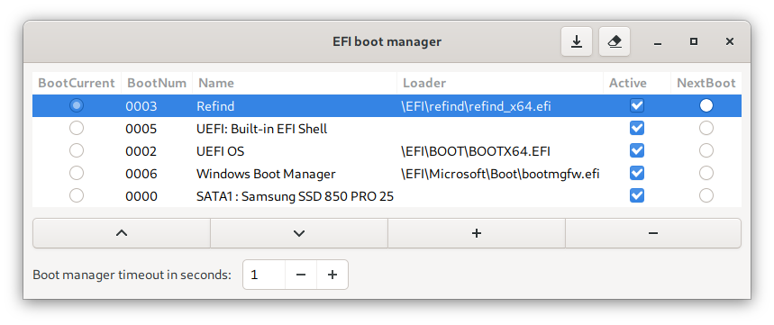

# EFI Boots

Manage EFI boot loader entries with this simple GUI.

This is how it looks on my machine:  


You can:

- reorder, add, delete, enable or disable boot entries
- choose what to boot into at the next reboot (NextBoot)
- set the time to wait before the first entry (or the NextBoot one) is selected

Beware that efibootmgr acts on EFI variables and that could be dangerous on
non-standard compliant implementations.

## Dependencies

If you are using Debian GNU/Linux:

```
sudo apt install efibootmgr python3
```

Not all distros install **python-gobject** automatically with Python3, but it is
required to run this script.

For Arch users:

```
sudo pacman -S --needed efibootmgr python3 python-gobject
```

With nix package manager:

```
nix-build
nix-env -i $(realpath result)
```

## Usage

```
$ python3 efiboots
```

If the program is unable to correctly auto-detect the ESP (EFI System Partition)
you can manually pass --disk and --part like this (assuming ESP is on /dev/sda1):

```
$ python3 efiboots --disk /dev/sda --part 1
```

You can also [report the issue](https://github.com/Elinvention/efibootmgr-gui/issues/new),
so that I can improve the auto-detection algorithm.

## Contributing

Contributions are welcome. Development happens on the ["main" branch](https://github.com/Elinvention/efibootmgr-gui/tree/main).
